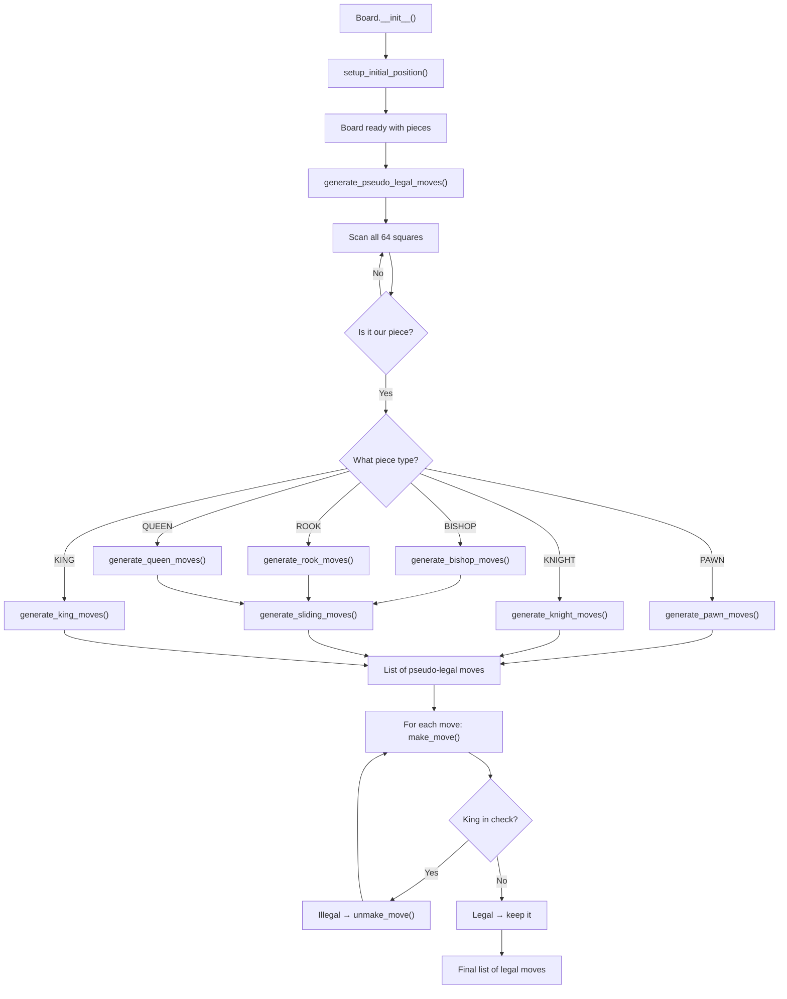

# 🎓 PyChess — Complete Logic Guide

> **Everything from concept to code, step by step.**
>
> This guide documents every idea, every design decision, and every line of logic in the PyChess engine.
> No fixes — just understanding.

---

## Table of Contents

1. [The Big Picture — What is a Chess Engine?](#1-the-big-picture--what-is-a-chess-engine)
2. [Architecture Overview — How the Files Connect](#2-architecture-overview--how-the-files-connect)
3. [Module 1: `constants.py` — The Foundation](#3-module-1-constantspy--the-foundation)
4. [Module 2: `move.py` — Representing a Chess Move](#4-module-2-movepy--representing-a-chess-move)
5. [Module 3: `board.py` — The Heart of the Engine](#5-module-3-boardpy--the-heart-of-the-engine)
   - [Part A: Board Initialization](#part-a-board-initialization--init__)
   - [Part B: Setting Up Pieces](#part-b-setting-up-pieces--setup_initial_position)
   - [Part C: Reading the Board](#part-c-reading-the-board--piece_at)
   - [Part D: Pawn Move Generation](#part-d-pawn-move-generation--generate_pawn_moves)
   - [Part E: Knight Move Generation](#part-e-knight-move-generation--generate_knight_moves)
   - [Part F: Sliding Piece Engine](#part-f-sliding-piece-engine--generate_sliding_moves)
   - [Part G: Bishop, Rook, Queen](#part-g-bishop-rook-queen--wrappers-around-sliding-moves)
   - [Part H: King Move Generation](#part-h-king-move-generation--generate_king_moves)
   - [Part I: Pseudo-Legal Move Dispatcher](#part-i-pseudo-legal-move-dispatcher--generate_pseudo_legal_moves)
   - [Part J: Making a Move](#part-j-making-a-move--make_move)
   - [Part K: Unmaking a Move](#part-k-unmaking-a-move--unmake_move)
6. [How Everything Fits Together](#6-how-everything-fits-together)
7. [Known Bugs & Typos (For Awareness)](#7-known-bugs--typos-for-awareness)
8. [What Comes Next](#8-what-comes-next)

---

## 1. The Big Picture — What is a Chess Engine?

A chess engine is a program that can **play chess**. At its core, every chess engine follows this pipeline:

```
   Represent the Board
          ↓
   Generate All Possible Moves
          ↓
   Filter to Legal Moves Only
          ↓
   Evaluate Positions (who's winning?)
          ↓
   Search for the Best Move (look ahead)
          ↓
   Play the Move
```

This PyChess project is building that pipeline **from scratch**, one layer at a time.

### Current scope

The engine currently implements the first two layers:

| Layer                | Status       | What it does                                  |
|:---------------------|:-------------|:----------------------------------------------|
| Board Representation | ✅ Done      | Store pieces on an 8×8 grid                   |
| Move Generation      | ✅ Done      | Generate all pseudo-legal moves               |
| Make/Unmake Move     | ✅ Done      | Execute and reverse moves on the board        |
| Legal Move Filtering | ⬜ Not yet   | Reject moves that leave the king in check     |
| Evaluation           | ⬜ Not yet   | Score a position (material, position, etc.)   |
| Search               | ⬜ Not yet   | Minimax / Alpha-Beta to find the best move    |

### What is a "pseudo-legal" move?

A **pseudo-legal move** follows the movement rules of the piece (a knight moves in an L, a bishop moves diagonally, etc.) but does **not** check whether the resulting position leaves the player's own king in check. A truly **legal** move is a pseudo-legal move that also keeps the king safe.

The process to get legal moves:

```
1. Generate pseudo-legal moves
2. For each move:
   a. make_move()      → execute it on the board
   b. Is my king in check?
      - Yes → illegal, discard
      - No  → legal, keep
   c. unmake_move()     → reverse it
3. Result: list of legal moves
```

This is why the engine has both `make_move()` and `unmake_move()` — they enable "try and undo" without copying the entire board.

---

## 2. Architecture Overview — How the Files Connect

```
┌──────────────────────────────────────────────────────────┐
│                        PyChess                           │
│                                                          │
│  ┌──────────────┐                                        │
│  │ constants.py  │  Defines piece types (PAWN=1, etc.)   │
│  │               │  and colors (WHITE=8, BLACK=16).      │
│  └──────┬───────┘                                        │
│         │  imported by                                   │
│         ▼                                                │
│  ┌──────────────┐                                        │
│  │   move.py     │  The Move class — stores from/to      │
│  │               │  squares, promotion, castling,        │
│  │               │  en passant flags.                    │
│  └──────┬───────┘                                        │
│         │  imported by                                   │
│         ▼                                                │
│  ┌──────────────┐                                        │
│  │   board.py    │  The Board class — the 8×8 grid,      │
│  │               │  game state, move generation,         │
│  │               │  make/unmake moves.                   │
│  └──────┬───────┘                                        │
│         │  used by                                       │
│         ▼                                                │
│  ┌──────────────┐                                        │
│  │   test.py     │  Testing & demo script.               │
│  └──────────────┘                                        │
└──────────────────────────────────────────────────────────┘
```

### Import chain

```python
# board.py imports:
from move import Move        # needs the Move class
from constants import *      # needs PAWN, KNIGHT, WHITE, BLACK, etc.
```

The data flows **upward**: constants define the vocabulary, Move defines how to describe an action, and Board uses both to simulate the game.

---

## 3. Module 1: `constants.py` — The Foundation

**File:** `constants.py` (20 lines)

This is the smallest but most fundamental file. It defines **how chess pieces are represented as integers**.

### The raw constants

```python
# Piece Types
EMPTY  = 0
PAWN   = 1
KNIGHT = 2
BISHOP = 3
ROOK   = 4
QUEEN  = 5
KING   = 6

# Colors
WHITE = 8
BLACK = 16
```

### Why integers instead of strings?

Integers allow **bitwise operations** — fast, compact, and elegant. Instead of storing `"White Queen"` (12 characters, ~12 bytes), we store a single integer `13` (a few bytes). More importantly, we can extract color and type from a single number using bit masking.

### The Bitwise Encoding System (READ THIS CAREFULLY)

Every integer is stored as binary (1s and 0s). The constants are designed so that **color and piece type occupy different bit positions**:

```
Bit layout:   [ color  color  _  type  type  type ]
               bit 4   bit 3      bit 2  bit 1  bit 0

PAWN   = 1  = 0 0  0 0 1
KNIGHT = 2  = 0 0  0 1 0
BISHOP = 3  = 0 0  0 1 1
ROOK   = 4  = 0 0  1 0 0
QUEEN  = 5  = 0 0  1 0 1
KING   = 6  = 0 0  1 1 0

WHITE  = 8  = 0 1  0 0 0     ← only bit 3 is set
BLACK  = 16 = 1 0  0 0 0     ← only bit 4 is set
EMPTY  = 0  = 0 0  0 0 0     ← all zeros
```

**Key insight:** The piece type bits (0–2) and the color bits (3–4) **never overlap**. This means we can combine them with `|` (OR) and separate them with `&` (AND).

### Combining: `|` (bitwise OR)

OR means: "if EITHER bit is 1, the result is 1."

```
WHITE | QUEEN
= 0 1 0 0 0  |  0 0 1 0 1
  ─────────────────────────
= 0 1 1 0 1
= 13 (decimal)
```

Since color bits and type bits don't overlap, OR simply "merges" them.

**All piece values:**

| Piece         | Calculation           | Binary     | Decimal |
|:--------------|:----------------------|:-----------|:--------|
| White Pawn    | `WHITE \| PAWN`       | `01 001`   | 9       |
| White Knight  | `WHITE \| KNIGHT`     | `01 010`   | 10      |
| White Bishop  | `WHITE \| BISHOP`     | `01 011`   | 11      |
| White Rook    | `WHITE \| ROOK`       | `01 100`   | 12      |
| White Queen   | `WHITE \| QUEEN`      | `01 101`   | 13      |
| White King    | `WHITE \| KING`       | `01 110`   | 14      |
| Black Pawn    | `BLACK \| PAWN`       | `10 001`   | 17      |
| Black Knight  | `BLACK \| KNIGHT`     | `10 010`   | 18      |
| Black Bishop  | `BLACK \| BISHOP`     | `10 011`   | 19      |
| Black Rook    | `BLACK \| ROOK`       | `10 100`   | 20      |
| Black Queen   | `BLACK \| QUEEN`      | `10 101`   | 21      |
| Black King    | `BLACK \| KING`       | `10 110`   | 22      |
| Empty         | —                     | `00 000`   | 0       |

### Extracting: `&` (bitwise AND)

AND means: "BOTH bits must be 1 for the result to be 1."

**Get piece type → `piece & 7`**

```
7 in binary = 0 0 1 1 1    ← a "mask" keeping only the low 3 bits

Example: What type is 13 (White Queen)?
  0 1 1 0 1    (13)
& 0 0 1 1 1    (7)
  ─────────
= 0 0 1 0 1    = 5 = QUEEN ✓
```

**Get color → `piece & 24`**

```
24 in binary = 1 1 0 0 0   ← a "mask" keeping only the top 2 bits

Example: What color is 17 (Black Pawn)?
  1 0 0 0 1    (17)
& 1 1 0 0 0    (24)
  ─────────
= 1 0 0 0 0    = 16 = BLACK ✓

Example: What color is 13 (White Queen)?
  0 1 1 0 1    (13)
& 1 1 0 0 0    (24)
  ─────────
= 0 1 0 0 0    = 8 = WHITE ✓
```

### Quick reference card

Every time you see these patterns in the code, here's what they mean:

| Expression               | Meaning                                  |
|:-------------------------|:-----------------------------------------|
| `piece & 7`              | "What type of piece is this?"            |
| `piece & 24`             | "What color is this piece?"              |
| `color \| type`          | "Create a piece of this color and type"  |
| `(target & 24) != color` | "Is this an enemy piece?"                |
| `target == EMPTY`        | "Is this square empty?" (EMPTY = 0)      |
| `piece == EMPTY`         | "Is there nothing on this square?"       |

---

## 4. Module 2: `move.py` — Representing a Chess Move

**File:** `move.py` (24 lines)

A **Move** is a data object that describes one action: moving a piece from one square to another, possibly with special effects.

### The `Move` class

```python
class Move:
    def __init__(self, from_row, from_col, to_row, to_col,
                 promotion=None, is_castling=False, is_en_passant=False):
        self.from_row = from_row
        self.from_col = from_col
        self.to_row = to_row
        self.to_col = to_col
        self.promotion = promotion        # QUEEN, BISHOP, ROOK, or KNIGHT
        self.is_castling = is_castling    # True if this is a castling move
        self.is_en_passant = is_en_passant  # True if this is en passant
```

### Understanding the coordinate system

The board uses a `[row][col]` system where:

```
row 0 = rank 1 (White's back rank)     col 0 = a-file (leftmost)
row 1 = rank 2                         col 1 = b-file
row 2 = rank 3                         col 2 = c-file
row 3 = rank 4                         col 3 = d-file
row 4 = rank 5                         col 4 = e-file
row 5 = rank 6                         col 5 = f-file
row 6 = rank 7                         col 6 = g-file
row 7 = rank 8 (Black's back rank)     col 7 = h-file
```

**Examples:**

| Move description       | Code                          | Meaning                  |
|:-----------------------|:------------------------------|:-------------------------|
| Pawn e2 → e4           | `Move(1, 4, 3, 4)`           | row 1 col 4 → row 3 col 4 |
| Knight g1 → f3         | `Move(0, 6, 2, 5)`           | row 0 col 6 → row 2 col 5 |
| Pawn promotes on e8    | `Move(6, 4, 7, 4, promotion=QUEEN)` | row 6 → row 7, becomes Queen |
| White kingside castle  | `Move(0, 4, 0, 6, is_castling=True)` | King e1 → g1       |
| En passant capture     | `Move(4, 4, 5, 3, is_en_passant=True)` | Pawn captures diagonally |

### The three special flags

| Flag           | When it's used                                           |
|:---------------|:---------------------------------------------------------|
| `promotion`    | A pawn reaches the last rank and becomes another piece   |
| `is_castling`  | The king moves two squares and the rook jumps over       |
| `is_en_passant`| A pawn captures an enemy pawn that just double-pushed    |

These flags tell `make_move()` to perform **extra work** beyond just moving the piece.

### String representation — `__str__`

```python
def __str__(self):
    """Convert move to algebraic notation"""
    files = 'abcdefgh'
    from_square = f"{files[self.from_col]}{self.from_row + 1}"
    to_square = f"{files[self.to_col]}{self.to_row + 1}"

    if self.promotion:
        piece_symbols = {QUEEN: 'q', ROOK: 'r', BISHOP: 'b', KNIGHT: 'n'}
        return f"{from_square}{to_square}{piece_symbols[self.promotion]}"

    return f"{from_square}{to_square}"
```

**How it works step by step:**

1. `files = 'abcdefgh'` — maps column indices to file letters:
   - `files[0]` = `'a'`, `files[4]` = `'e'`, `files[7]` = `'h'`

2. Build the square name:
   - `from_col = 4` → `files[4]` = `'e'`
   - `from_row = 1` → `1 + 1` = `2`
   - Result: `"e2"`

3. If promotion, append the piece letter:
   - `Move(6, 4, 7, 4, promotion=QUEEN)` → `"e7e8q"`

**Output examples:**

| Move                        | `str(move)` |
|:----------------------------|:------------|
| `Move(1, 4, 3, 4)`         | `"e2e4"`    |
| `Move(0, 6, 2, 5)`         | `"g1f3"`    |
| `Move(6, 4, 7, 4, QUEEN)`  | `"e7e8q"`   |

### `__repr__`

```python
def __repr__(self):
    return self.__str__()
```

This makes Move objects display nicely in lists and debuggers — `[e2e4, d2d4, g1f3, ...]` instead of `[<Move object at 0x...>, ...]`.

---

## 5. Module 3: `board.py` — The Heart of the Engine

**File:** `board.py` (343 lines)

This is the main module. It contains the `Board` class, which manages:
- The 8×8 grid of pieces
- Game state (whose turn, castling rights, en passant, clocks)
- Move generation for every piece type
- Making and unmaking moves

### Import statements

```python
from move import Move          # Needs the Move class to create move objects
from constants import *        # Imports all constants: PAWN, KNIGHT, WHITE, BLACK, etc.
import pst                     # Piece-square tables (not used in current code)
```

---

### Part A: Board Initialization — `__init__`

```python
def __init__(self):
    self.board = [[EMPTY for _ in range(8)] for _ in range(8)]
```

**What this does:** Creates a list of 8 lists, each containing 8 zeros. This is the 8×8 chessboard.

**Visualized:**

```
self.board[row][col]

        col 0  col 1  col 2  col 3  col 4  col 5  col 6  col 7
         (a)    (b)    (c)    (d)    (e)    (f)    (g)    (h)
row 7:  [  0,     0,     0,     0,     0,     0,     0,     0 ]  ← rank 8
row 6:  [  0,     0,     0,     0,     0,     0,     0,     0 ]  ← rank 7
row 5:  [  0,     0,     0,     0,     0,     0,     0,     0 ]  ← rank 6
row 4:  [  0,     0,     0,     0,     0,     0,     0,     0 ]  ← rank 5
row 3:  [  0,     0,     0,     0,     0,     0,     0,     0 ]  ← rank 4
row 2:  [  0,     0,     0,     0,     0,     0,     0,     0 ]  ← rank 3
row 1:  [  0,     0,     0,     0,     0,     0,     0,     0 ]  ← rank 2
row 0:  [  0,     0,     0,     0,     0,     0,     0,     0 ]  ← rank 1
```

**Key mapping:** `board[0][0]` = **a1**, `board[0][4]` = **e1** (White King's square), `board[7][7]` = **h8**.

### Game state variables

```python
self.to_move = WHITE
```

Whose turn it is. Starts with White. Flips between `WHITE` (8) and `BLACK` (16) after every move.

```python
self.castling_rights = {
    'K': True,   # White kingside  (O-O)
    'Q': True,   # White queenside (O-O-O)
    'k': True,   # Black kingside  (O-O)
    'q': True    # Black queenside (O-O-O)
}
```

Uppercase = White, lowercase = Black. These get set to `False` when the corresponding king or rook moves. Once `False`, they never go back to `True` (unless restored by `unmake_move`).

```python
self.en_passant_square = None
```

If a pawn just made a double-push, this stores the square it "skipped over" as a `(row, col)` tuple. Otherwise `None`. Gets reset every single move.

**Example:** If a White pawn goes e2→e4, then `en_passant_square = (2, 4)` = e3 (the skipped square). Now if a Black pawn is on d4 or f4, it can capture en passant by moving to e3.

```python
self.halfmove_clock = 0
```

Counts half-moves (plies) since the last pawn move or capture. Used for the 50-move draw rule: if this reaches 100 (= 50 full moves without a pawn move or capture), the game is a draw. Resets to 0 whenever a pawn moves or a piece is captured.

```python
self.fullmove_number = 1
```

Starts at 1. Increments by 1 after **Black** moves (not after White). So after White's first move it's still 1; after Black's first move it becomes 2.

```python
self.setup_initial_position()
```

Calls the function to place all pieces in their starting positions.

---

### Part B: Setting Up Pieces — `setup_initial_position`

```python
def setup_initial_position(self):
    back_rank = [ROOK, KNIGHT, BISHOP, QUEEN, KING, BISHOP, KNIGHT, ROOK]
```

This list defines the order of pieces on the back rank, from the a-file to the h-file:

```
Index:  0     1       2       3      4     5       6       7
File:   a     b       c       d      e     f       g       h
Piece:  ROOK  KNIGHT  BISHOP  QUEEN  KING  BISHOP  KNIGHT  ROOK
```

This matches the standard chess starting position.

### First loop — Rows 7 and 6 (rank 8 and rank 7)

```python
for i in range(8):
    self.board[7][i] = WHITE | back_rank[i]   # row 7 = rank 8
    self.board[6][i] = BLACK | PAWN           # row 6 = rank 7
```

**Tracing `i = 0`:**
- `board[7][0] = WHITE | ROOK = 8 | 4 = 12` → a piece on a8
- `board[6][0] = BLACK | PAWN = 16 | 1 = 17` → Black Pawn on a7

**Tracing `i = 4`:**
- `board[7][4] = WHITE | KING = 8 | 6 = 14` → a piece on e8
- `board[6][4] = BLACK | PAWN = 16 | 1 = 17` → Black Pawn on e7

> **Note:** Row 7 is intended to hold Black's back rank pieces, but the code uses `WHITE |` instead of `BLACK |`. This is a known bug — the intent is Black pieces on rows 6–7 and White pieces on rows 0–1.

### Second loop — Rows 1 and 0 (rank 2 and rank 1)

```python
for i in range(8):
    self.board[1][i] = WHITE | PAWN           # row 1 = rank 2
    self.board[0][i] = WHITE | back_rank[i]   # row 0 = rank 1
```

**Tracing `i = 0`:**
- `board[1][0] = WHITE | PAWN = 9` → White Pawn on a2
- `board[0][0] = WHITE | ROOK = 12` → White Rook on a1

### Resulting board state

After setup, the board contains these numeric values:

```
row 7: [ 12, 10, 11, 13, 14, 11, 10, 12 ]  ← WHITE back rank (intended: BLACK)
row 6: [ 17, 17, 17, 17, 17, 17, 17, 17 ]  ← BLACK PAWNs
row 5: [  0,  0,  0,  0,  0,  0,  0,  0 ]  ← empty
row 4: [  0,  0,  0,  0,  0,  0,  0,  0 ]  ← empty
row 3: [  0,  0,  0,  0,  0,  0,  0,  0 ]  ← empty
row 2: [  0,  0,  0,  0,  0,  0,  0,  0 ]  ← empty
row 1: [  9,  9,  9,  9,  9,  9,  9,  9 ]  ← WHITE PAWNs
row 0: [ 12, 10, 11, 13, 14, 11, 10, 12 ]  ← WHITE back rank
```

---

### Part C: Reading the Board — `piece_at`

```python
def piece_at(self, row, col):
    return self.board[row][col]
```

Simple lookup. Returns the integer at that position. Use `& 7` to get the type and `& 24` to get the color.

**Example:**
```python
piece = board.piece_at(0, 4)   # = 14 (WHITE | KING)
piece_type = piece & 7         # = 6 = KING
color = piece & 24             # = 8 = WHITE
```

---

### Part D: Pawn Move Generation — `generate_pawn_moves`

This is the most complex move generator because pawns have the most special rules: they move differently than they capture, they can double-push from the start, they promote on the last rank, and they have en passant.

#### Step 1: Determine direction

```python
piece = self.board[row][col]
color = piece & 24
```

Gets the piece, extracts its color.

```python
if color == WHITE:
    direction = 1         # White pawns move UP (increasing row)
    start_row = 1         # White pawns begin on row 1 (rank 2)
    promotion_row = 7     # White promotes on row 7 (rank 8)
else:
    direction = -1        # Black pawns move DOWN (decreasing row)
    start_row = 6         # Black pawns begin on row 6 (rank 7)
    promotion_row = 0     # Black promotes on row 0 (rank 1)
```

**Why `direction`?** Adding `direction` to the current row gives the "forward" square. White goes toward row 7 (+1), Black goes toward row 0 (-1).

#### Step 2: Single push

```python
if self.board[row + direction][col] == EMPTY:
```

"Is the square directly ahead empty?" Pawns can only push forward to an empty square — they cannot capture forward.

**Example:** White pawn on e2 (row=1, col=4). `row + direction = 1 + 1 = 2`. Checks if e3 (`board[2][4]`) is empty.

```python
    if row + direction == promotion_row:
        for promo_piece in [QUEEN, ROOK, BISHOP, KNIGHT]:
            moves.append(Move(row, col, row + direction, col, promotion=promo_piece))
```

"If I land on the last rank, this is a **promotion**." Four separate moves are generated — one for each piece the pawn can promote to (Queen, Rook, Bishop, Knight).

```python
    else:
        moves.append(Move(row, col, row + direction, col))
```

Otherwise, normal single push — just move forward one square.

#### Step 3: Double push (nested inside single push)

```python
    if row == start_row and self.board[row + 2 * direction][col] == EMPTY:
        moves.append(Move(row, col, row + 2 * direction, col))
```

**Why is this inside the single-push `if` block?** Because a pawn can only double-push if **both** squares ahead are empty. If the first square wasn't empty, we never entered the single-push block, so we never reach this code. The pawn can't jump over a piece.

**Example:** White pawn on e2 (row=1). `row == start_row` → `1 == 1` → True. Checks if e4 (`board[3][4]`) is also empty. If yes, can push to e4.

#### Step 4: Captures (diagonal)

```python
for dcol in [-1, 1]:
    new_col = col + dcol
```

Pawns capture **diagonally** — one square ahead and one column left (`dcol = -1`) or right (`dcol = +1`).

```python
    if 0 <= new_col < 8:
```

Don't go off the board. If the pawn is on the a-file (col=0), `col + (-1) = -1` — off the board, skip.

```python
        new_row = row + direction
        target = self.board[new_row][new_col]
```

The diagonal capture square.

```python
        if target != EMPTY and (target & 24) != color:
```

Two conditions for a capture:
1. Something is there (`!= EMPTY`)
2. It's an **enemy** piece (`(target & 24)` extracts its color; if different from ours, it's an enemy)

```python
            if new_row == promotion_row:
                for promo_piece in [QUEEN, ROOK, BISHOP, KNIGHT]:
                    moves.append(Move(row, col, new_row, new_col, promotion=promo_piece))
            else:
                moves.append(Move(row, col, new_row, new_col))
```

Same promotion logic — if capturing onto the last rank, generate four promotion moves.

#### Step 5: En passant

```python
        if self.en_passant_square == (new_row, new_col):
            moves.append(Move(row, col, new_row, new_col, is_en_passant=True))
```

If the diagonal square matches the en passant target, generate an en passant capture. The `is_en_passant=True` flag tells `make_move()` to remove the captured pawn from a special location (not the destination square).

**How en passant works:**

```
1. Black pawn on d7 double-pushes to d5
2. en_passant_square is set to d6 (the skipped square)
3. White pawn on e5 can capture "through" d6
4. The Black pawn on d5 is removed

Before:                After en passant:
. . . p . . . .       . . . . . . . .
. . . . . . . .       . . . . . . . .
. . . . . . . .       . . . P . . . .    ← White pawn lands on d6
. . . p P . . .       . . . . . . . .    ← Black pawn removed from d5
```

---

### Part E: Knight Move Generation — `generate_knight_moves`

```python
piece = self.board[row][col]
color = piece & 24
```

Get the piece, extract color.

```python
knight_offsets = [
    (-2, -1), (-2, 1), (-1, -2), (-1, 2),
    (1, -2),  (1, 2),  (2, -1),  (2, 1)
]
```

Knights move in an **L-shape**: 2 squares in one direction, 1 in the perpendicular. This gives 8 possible landing squares:

```
. . . . . . . .
. . x . x . . .     x = possible moves from N
. x . . . x . .
. . . N . . . .     N = knight position
. x . . . x . .
. . x . x . . .
. . . . . . . .
```

Each tuple is `(row_offset, col_offset)`.

```python
for drow, dcol in knight_offsets:
    new_row, new_col = row + drow, col + dcol

    if 0 <= new_row < 8 and 0 <= new_col < 8:
        target = self.board[new_row][new_col]
        if target == EMPTY or (target & 24) != color:
            moves.append(Move(row, col, new_row, new_col))
```

For each offset:
1. Calculate the landing square
2. Check it's on the board (row and col both 0–7)
3. Check the square is either empty or has an enemy piece
4. If valid, add the move

Knights **jump** — they don't care about pieces in between.

**Example:** Knight on b1 (row=0, col=1).
- Offset `(2, -1)` → `(2, 0)` = a3 ✓
- Offset `(2, 1)` → `(2, 2)` = c3 ✓
- Offset `(-2, -1)` → `(-2, 0)` = off the board ✗
- Offset `(1, -2)` → `(1, -1)` = off the board ✗

---

### Part F: Sliding Piece Engine — `generate_sliding_moves`

This is the **shared engine** for Bishop, Rook, and Queen. They all "slide" — they move along a straight line until they hit something.

```python
def generate_sliding_moves(self, row, col, moves, directions):
    piece = self.board[row][col]
    color = piece & 24
```

The `directions` parameter is a list of `(drow, dcol)` tuples defining which directions to slide in.

```python
    for drow, dcol in directions:
        new_row, new_col = row + drow, col + dcol
```

Start one step in this direction.

```python
        while 0 <= new_row < 8 and 0 <= new_col < 8:
            target = self.board[new_row][new_col]
```

Keep going while on the board.

```python
            if target == EMPTY:
                moves.append(Move(row, col, new_row, new_col))
```

**Empty square:** Add the move, **keep sliding** (don't break).

```python
            elif (target & 24) != color:
                moves.append(Move(row, col, new_row, new_col))
                break   # Can capture but can't go past
```

**Enemy piece:** Add the capture, then **STOP**. You land on the enemy but can't go through.

```python
            else:
                break   # Blocked by own piece — can't move here at all
```

**Friendly piece:** **STOP**. Can't capture or pass your own pieces.

```python
            new_row += drow
            new_col += dcol
```

Take another step in the same direction (only reached if we didn't `break`).

#### Visual example — Rook on d4 (row=3, col=3)

```
Direction (1, 0) = going UP:

  row 7: d8 → empty → add move, keep going
  row 6: d7 → empty → add move, keep going
  row 5: d6 → enemy piece → add capture, STOP
  row 4: d5 → empty → add move, keep going
  --------
  row 3: d4 = ROOK (starting position)

Direction (0, 1) = going RIGHT:

  col 4: e4 → empty → add move, keep going
  col 5: f4 → empty → add move, keep going
  col 6: g4 → own piece → STOP (no move added)
```

---

### Part G: Bishop, Rook, Queen — Wrappers Around Sliding Moves

These three functions just call `generate_sliding_moves` with the appropriate directions.

#### `generate_bishop_moves`

```python
def generate_bishop_moves(self, row, col, moves):
    directions = [(-1, -1), (-1, 1), (1, -1), (1, 1)]
    self.generate_bishop_moves(row, col, moves, directions)   # BUG: should be generate_sliding_moves
```

**Directions = 4 diagonals:**
```
(-1,-1) = ↙ down-left       (-1, 1) = ↘ down-right
( 1,-1) = ↖ up-left         ( 1, 1) = ↗ up-right
```

> **Bug:** The function calls itself (`generate_bishop_moves`) instead of `generate_sliding_moves`. This would cause infinite recursion.

#### `generate_rook_moves`

```python
def generate_rook_moves(self, row, col, moves):
    directions = [(-1, 0), (1, 0), (0, -1), (0, 1)]
    self.generate_sliding_moves(row, col, moves, directions)
```

**Directions = 4 straights:**
```
(-1, 0) = ↓ down       (1, 0) = ↑ up
( 0,-1) = ← left       (0, 1) = → right
```

#### `generate_queen_moves`

```python
def generate_queen_moves(self, row, col, moves):
    directions = [
        (-1, -1), (-1, 0), (-1, 1),
        (0, -1),           (0, 1),
        (1, -1),  (1, 0),  (1, 1)
    ]
    self.generate_sliding_moves(row, col, moves, directions)
```

**Directions = all 8** (diagonals + straights). The Queen = Bishop + Rook combined.

```
↖ ↑ ↗
←  Q  →
↙ ↓ ↘
```

---

### Part H: King Move Generation — `generate_king_moves`

#### Step 1: Regular moves (one square in any direction)

```python
piece = self.baord[row][col]   # Note: typo "baord"
color = piece & 24
```

```python
for drow in [-1, 0, 1]:
    for dcol in [-1, 0, 1]:
        if drow == 0 and dcol == 0:
            continue       # skip "staying in place"
```

This nested loop generates all 8 surrounding squares:

```
(-1,-1) (-1, 0) (-1, 1)       ↖  ↑  ↗
( 0,-1)  KING   ( 0, 1)   →   ←  K  →
( 1,-1) ( 1, 0) ( 1, 1)       ↙  ↓  ↘
```

The `(0, 0)` combination means "don't move" — skip it.

```python
        new_row, new_col = row + drow, col + dcol

        if 0 <= new_row < 8 and 0 <= new_col < 8:
            target = self.board[new_row][new_col]
            if target == EMPTY or (target & 24) != color:
                moves.append(Move(row, col, new_row, new_col))
```

Same logic as knight: must be on the board, must be empty or enemy. The king is like a queen that can only move **one step**.

> **Note:** This is pseudo-legal — no check detection yet. The king could "move into check" here; that will be filtered later.

#### Step 2: Castling — White

```python
if color == WHITE and row == 0:
```

White king should be on row 0 (rank 1).

**Kingside (O-O):**
```python
    if (self.castling_rights['K'] and
        self.board[0][5] == EMPTY and
        self.board[0][6] == EMPTY):
        moves.append(Move(0, 4, 0, 6, is_castling=True))
```

Requirements:
1. `'K'` right is still `True` (king and h1-rook haven't moved)
2. f1 (col 5) is empty
3. g1 (col 6) is empty

The king moves from e1 (col 4) to g1 (col 6).

```
Before:  R . . . K . . R        After:  R . . . . R K .
         a  b  c  d  e  f  g  h          a  b  c  d  e  f  g  h
```

**Queenside (O-O-O):**
```python
    if (self.castling_rights['Q'] and
        self.board[0][1] == EMPTY and
        self.board[0][2] == EMPTY and
        self.board[0][3] == EMPTY):
        moves.append(Move(7, 4, 7, 6, is_castling=True))   # BUG: wrong coordinates
```

Requirements: b1, c1, d1 all empty. King should go from e1 (col 4) to c1 (col 2).

> **Bug:** The Move uses `(7, 4, 7, 6)` instead of `(0, 4, 0, 2)`.

#### Step 3: Castling — Black

```python
elif color == BLACK and row == 7:
```

Same logic for Black on row 7 (rank 8).

**Kingside:**
```python
    if (self.castling_rights['k'] and
        self.board[7][5] == EMPTY and
        self.board[7][6] == EMPTY):
        moves.append(Move(7, 4, 7, 2, is_castling=True))   # BUG: should be (7,4,7,6)
```

**Queenside:**
```python
    if (self.castling_rights['q'] and
        self.board[7][1] == EMPTY and
        self.board[7][2] == EMPTY and
        self.board[7][3] == EMPTY):
        moves.append(Move(7, 4, 7, 2, is_castling=True))
```

> **Missing:** Full castling rules require checking that the king doesn't pass through or land on an attacked square. This needs `is_square_attacked()` which isn't implemented yet.

---

### Part I: Pseudo-Legal Move Dispatcher — `generate_pseudo_legal_moves`

This is the **master function** that scans the entire board and calls the right generator for each piece.

```python
def generate_pseudo_legal_moves(self):
    moves = []
```

Start with an empty list.

```python
    for row in range(8):
        for col in range(8):
            piece = self.board[row][col]
```

Scan every square (all 64).

```python
            if piece == EMPTY or (piece & 24) != self.to_move:
                continue
```

**Skip** if:
- The square is empty, OR
- The piece isn't ours (`piece & 24` = piece's color, `self.to_move` = whose turn)

```python
            piece_type = piece & 7
```

Extract the piece type.

```python
            if piece_type == PAWN:
                self.generate_pawn_moves(row, col, moves)
            elif piece_type == KNIGHT:
                self.generate_knight_moves(row, col, moves)
            elif piece_type == BISHOP:
                self.generate_bishop_moves(row, col, moves)
            elif piece_type == ROOK:
                self.generate_rook_moves(row, col, moves)
            elif piece_type == QUEEN:
                self.generate_queen_moves(row, col, moves)
            elif piece_type == KING:
                self.generate_king_moves(row, col, moves)
```

Dispatch to the correct generator based on piece type. Each generator **appends** to the shared `moves` list.

```python
    return moves
```

Return the complete list of pseudo-legal moves.

#### Why "pseudo-legal"?

These moves follow piece movement rules but **don't verify king safety**. For example:
- A pinned piece can be "moved" here even though it would expose the king
- The king can "move" into check

The eventual legality filter:
1. For each pseudo-legal move → `make_move()`
2. Is our king now attacked? → `is_square_attacked()` (not yet implemented)
3. If yes → illegal, `unmake_move()` and discard
4. If no → legal, `unmake_move()` and keep

---

### Part J: Making a Move — `make_move`

This function **executes** a move on the board and returns the information needed to reverse it.

#### Step 1: Save undo state

```python
undo = {
    'captured_piece': self.board[move.to_row][move.to_col],
    'captured_rights': self.castling_rights.copy(),
    'en_passant_square': self.en_passant_square,
    'halfmove_clock': self.halfmove_clock
}
```

Everything that might change is saved into a dictionary:
- `captured_piece`: Whatever is on the destination square (could be EMPTY or an enemy piece)
- `captured_rights`: A **copy** of the castling rights (not a reference — `.copy()` is critical)
- `en_passant_square`: Current en passant target
- `halfmove_clock`: Current clock value

#### Step 2: Get the moving piece

```python
piece = self.board[move.from_row][move.from_col]
piece_type = piece & 7
```

**Example:** White pawn e2→e4.
- `piece = board[1][4] = 9` (WHITE | PAWN)
- `piece_type = 9 & 7 = 1 = PAWN`

#### Step 3: Move the piece

```python
self.board[move.to_row][move.to_col] = piece        # place piece on destination
self.board[move.from_row][move.from_col] = EMPTY     # clear the origin
```

This is the core move — remove from source, place at destination.

#### Step 4: Handle promotion

```python
if move.promotion:
    self.board[move.to_row][move.to_col] = (piece & 24) | move.promotion
```

If the move is a promotion:
- `piece & 24` = keep the color (e.g., WHITE = 8)
- `| move.promotion` = set the new piece type (e.g., QUEEN = 5)
- Result: `8 | 5 = 13` = White Queen

**The pawn becomes the promoted piece.**

#### Step 5: Handle en passant capture

```python
if move.is_en_passant:
    capture_row = move.from_row
    self.board[capture_row][move.to_col] = EMPTY
```

En passant is special: the captured pawn is **not** on the destination square. It's on the **same row** as the moving pawn but in the **destination column**.

```
Before en passant:              After:
. . . . . . . .                . . . . . . . .
. . . . . . . .                . . . P . . . .   ← pawn moved diagonally here
. . . p P . . .                . . . . . . . .   ← enemy pawn removed from HERE
. . . . . . . .                . . . . . . . .
```

`capture_row = move.from_row` is the row where the captured pawn actually sits.

#### Step 6: Handle castling — move the rook

```python
if move.is_castling:
    if move.to_col == 6:   # Kingside
        self.board[move.to_row][5] = self.board[move.to_row][7]  # rook h→f
        self.board[move.to_row][7] = EMPTY
    else:                  # Queenside
        self.board[move.to_row][3] = self.board[move.to_row][0]  # rook a→d
        self.board[move.to_row][0] = EMPTY
```

When the king castles, the rook **also moves** (step 3 already moved the king):
- **Kingside:** Rook goes from col 7 (h-file) → col 5 (f-file)
- **Queenside:** Rook goes from col 0 (a-file) → col 3 (d-file)

```
Kingside:     Before:  . . . . K . . R      After:  . . . . . R K .
                       col:     4       7                    5 6

Queenside:    Before:  R . . . K . . .      After:  . . K R . . . .
                       col: 0       4                   2 3
```

#### Step 7: Update en passant square

```python
self.en_passant_square = None
if piece_type == PAWN and abs(move.to_row - move.from_row) == 2:
    self.en_passant_square = ((move.from_row + move.to) // 2, move.from_col)
```

1. Clear any previous en passant target
2. If a pawn just double-pushed (`abs(to - from) == 2`), set the new en passant square to the row the pawn skipped over

`(from_row + to_row) // 2` = the midpoint between start and end.

**Example:** Pawn e2→e4 (row 1 → row 3). Midpoint = `(1 + 3) // 2 = 2`. En passant square = `(2, 4)` = e3.

> **Bug:** The code says `move.to` instead of `move.to_row`.

#### Step 8: Update castling rights

```python
if piece_type == KING:
    if self.to_move == WHITE:
        self.castling_rights['K'] = False
        self.castling_rights['Q'] = False
    else:
        self.castling_rights['k'] = False
        self.castling_rights['q'] = False
```

If the **king** moves, lose **both** castling rights for that color. Once the king moves, castling is permanently impossible.

```python
if piece_type == ROOK:
    if self.to_move == WHITE:
        if move.from_row == 0 and move.from_col == 0:     # a1 rook
            self.castling_rights['Q'] = False
        elif move.from_row == 0 and move.from_col == 7:   # h1 rook
            self.castling_rights['K'] = False
    else:
        if move.from_row == 7 and move.from_col == 0:     # a8 rook
            self.castling_rights['q'] = False
        elif move.from_row == 7 and move.from_col == 7:   # h8 rook
            self.castling_rights['k'] = False
```

If a **rook** moves, lose only **that side's** castling right. The a-file rook affects queenside; the h-file rook affects kingside.

#### Step 9: Update halfmove clock

```python
if piece_type == PAWN or undo_info['captured_piece'] != EMPTY:
    self.halfmove_clock = 0
else:
    self.halfmove_clock += 1
```

Reset to 0 on pawn moves or captures (these are "irreversible" — the position can never be reached again). Otherwise increment by 1.

> **Bug:** The variable is named `undo` in step 1 but referenced as `undo_info` here.

#### Step 10: Switch sides and return

```python
if self.to_move == BLACK:
    self.fullmove_number += 1
```

Fullmove number increments after Black moves (one full move = White plays + Black plays).

```python
self.to_move = BLACK if self.to_move == WHITE else WHITE
```

Flip whose turn it is.

```python
return undo_info
```

Return the saved state so `unmake_move()` can use it later.

> **Bug:** Returns `undo_info` but the variable was named `undo`.

---

### Part K: Unmaking a Move — `unmake_move`

This reverses everything `make_move()` did, restoring the board to its previous state.

```python
def unmake_move(self, move, undo_info):
```

Takes the move that was made and the undo dictionary returned by `make_move()`.

#### Step 1: Switch side back

```python
self.to_move = BLACK if self.to_move == WHITE else WHITE
```

`make_move` flipped the turn at the end, so flip it back. Now `self.to_move` is the color that originally made the move.

#### Step 2: Restore fullmove counter

```python
if self.to_move == BLACK:
    self.fullmove_number -= 1
```

If Black made the move, `make_move` incremented `fullmove_number`, so decrement it back.

#### Step 3: Get the moved piece

```python
piece = self.board[move.to_row][move.to_col]
```

The piece is currently on the destination square (where `make_move` placed it).

#### Step 4: Handle promotion reversal

```python
if move.promotion:
    piece = (piece & 24) | PAWN
```

If this was a promotion, the destination has a Queen/Rook/Bishop/Knight. Turn it back into a Pawn:
- `piece & 24` = keep the color
- `| PAWN` = make it a pawn again

#### Step 5: Put the piece back

```python
self.board[move.from_row][move.from_col] = piece
self.board[move.to_row][move.to_col] = undo_info['captured_piece']
```

- Origin: put the piece back where it came from
- Destination: restore whatever was there before (EMPTY or a captured piece)

#### Step 6: Restore en passant captured pawn

```python
if move.is_en_passant:
    capture_row = move.from_row
    opponent_color = BLACK if self.to_move == WHITE else WHITE
    self.board[capture_row][move.to_col] = opponent_color | PAWN
```

`make_move()` removed a pawn from `(from_row, to_col)`. Put it back — a pawn of the opponent's color.

#### Step 7: Restore castling rook

```python
if move.is_castling:
    if move.to_col == 6:   # Kingside
        self.board[move.to__row][7] = self.board[move.to_row][5]   # rook f→h
        self.board[move.to_row][5] = EMPTY
    else:                  # Queenside
        self.board[move.to_row][0] = self.board[move.to_row][3]    # rook d→a
        self.board[move.to_row][3] = EMPTY
```

Move the rook back to its original position:
- Kingside: rook goes from col 5 (f) back to col 7 (h)
- Queenside: rook goes from col 3 (d) back to col 0 (a)

> **Bug:** `move.to__row` has a double underscore (typo).

#### Step 8: Restore game state

```python
self.castling_rights = undo_info['castling_rights']
self.en_passant_square = undo_info['en_passant_square']
self.halfmove_clock = undo_info['halfmove_clock']
```

Restore all saved state directly from the undo dictionary.

> **Bug:** The key is `'castling_rights'` here but was saved as `'captured_rights'` in `make_move()`.

---

## 6. How Everything Fits Together

### The complete flow



### The make/unmake pattern

This is the **heart** of every chess engine. The same pattern is used in:

1. **Legality checking** — try a move, check if king is safe, undo
2. **Search algorithms** — Minimax and Alpha-Beta explore millions of positions by making and unmaking moves rapidly
3. **Perft testing** — count all possible positions to verify move generation correctness

```
generate_pseudo_legal_moves()
    │
    ▼
┌─────────────────────────────────┐
│  For each candidate move:       │
│                                 │
│    undo = make_move(move)       │
│         │                       │
│         ▼                       │
│    [Board is now modified]      │
│         │                       │
│         ▼                       │
│    Check legality / Evaluate    │
│         │                       │
│         ▼                       │
│    unmake_move(move, undo)      │
│         │                       │
│         ▼                       │
│    [Board is restored]          │
│                                 │
└─────────────────────────────────┘
```

### Data flow between modules

```
constants.py                  move.py                     board.py
────────────                  ───────                     ────────
PAWN = 1    ──────────┐       class Move    ──────────┐   class Board
KNIGHT = 2            │       ├─ from_row              │   ├─ board[8][8]
BISHOP = 3            ├──►    ├─ from_col              ├──►├─ to_move
ROOK = 4              │       ├─ to_row                │   ├─ castling_rights
QUEEN = 5             │       ├─ to_col                │   ├─ en_passant_square
KING = 6              │       ├─ promotion             │   ├─ generate_*_moves()
WHITE = 8   ──────────┘       ├─ is_castling           │   ├─ make_move()
BLACK = 16                    └─ is_en_passant  ───────┘   └─ unmake_move()
EMPTY = 0
```

---

## 7. Known Bugs & Typos (For Awareness)

These are documented for understanding, not for fixing.

| Location | Bug | Expected |
|:---------|:----|:---------|
| `setup_initial_position()` line 29 | `self.board[7][i] = WHITE \| back_rank[i]` | Should be `BLACK \| back_rank[i]` — row 7 is Black's back rank |
| `generate_bishop_moves()` line 136 | `self.generate_bishop_moves(row, col, moves, directions)` | Should be `self.generate_sliding_moves(...)` — calls itself causing infinite recursion |
| `generate_king_moves()` line 154 | `self.baord[row][col]` | Should be `self.board[row][col]` — typo in "board" |
| `generate_king_moves()` line 183 | `Move(7, 4, 7, 6, ...)` for White queenside | Should be `Move(0, 4, 0, 2, ...)` — wrong row and column |
| `generate_king_moves()` line 190 | `Move(7, 4, 7, 2, ...)` for Black kingside | Should be `Move(7, 4, 7, 6, ...)` — wrong to_col |
| `make_move()` line 266 | `move.to` | Should be `move.to_row` — attribute doesn't exist |
| `make_move()` line 291 | `undo_info['captured_piece']` | Should be `undo['captured_piece']` — variable was named `undo` |
| `make_move()` line 302 | `return undo_info` | Should be `return undo` — variable was named `undo` |
| `unmake_move()` line 332 | `self.board[move.to__row]` | Should be `self.board[move.to_row]` — double underscore |
| `unmake_move()` line 339 | `undo_info['castling_rights']` | Should be `undo_info['captured_rights']` — key mismatch with `make_move` |
| `is_square_attacked()` | Returns `pass` (no implementation) | Needs full implementation for legal move filtering |

---

## 8. What Comes Next

The engine has built the foundation. Here's the path forward:

### Phase 3: Legal Chess

```
is_square_attacked()     → Can a square be attacked by a given color?
                              (scan for enemy pawns, knights, sliding pieces, king)

find_king()              → Where is my king right now?

is_in_check()            → Is the current side's king in check?
                              (uses is_square_attacked on king's square)

generate_legal_moves()   → For each pseudo-legal move:
                              make_move() → is_in_check()? → unmake_move()
                              Keep only moves where king is NOT in check

is_checkmate()           → In check AND no legal moves? = Checkmate
is_stalemate()           → NOT in check AND no legal moves? = Stalemate
```

### Phase 4: Notation & Position Handling

```
FEN parsing              → Load a position from a FEN string
                              (e.g., "rnbqkbnr/pppppppp/8/8/4P3/8/PPPP1PPP/RNBQKBNR b KQkq e3 0 1")

FEN generation           → Export the current board state as a FEN string

Algebraic notation       → Convert moves to/from standard notation (e.g., "Nf3", "e4", "O-O")
```

### Phase 5: Chess Engine (AI)

```
Material evaluation      → Count piece values (pawn=1, knight=3, bishop=3, rook=5, queen=9)

Positional evaluation    → Piece-square tables (pieces on better squares score higher)

Minimax                  → Look ahead N moves, pick the best one
                              (recursively make/unmake moves, evaluate leaf positions)

Alpha-Beta pruning       → Optimization: skip branches that can't possibly be best

Move ordering            → Try best-looking moves first (captures, checks) for faster pruning

Quiescence search        → At leaf nodes, keep searching captures to avoid "horizon effect"

Transposition tables     → Cache evaluated positions to avoid re-computing
```

### Phase 6: Interface

```
CLI                      → Play chess in the terminal
GUI                      → Graphical board with mouse interaction
UCI protocol             → Standard interface so the engine can connect to chess GUIs
                              (Arena, CuteChess, Lichess, etc.)
```

---

> *One move at a time.* ♟️
